## blessed-contrib

Build dashboards (or any other application) using ascii/ansi art and javascript.

Friendly to terminals, ssh and developers. Extends [blessed](https://github.com/chjj/blessed) with custom  [drawille](https://github.com/madbence/node-drawille) and other widgets.

You should also [check WOPR](https://github.com/yaronn/wopr): a markup for creating terminal reports, presentations and infographics.


**Contributors:**

Yaron Naveh ([@YaronNaveh](http://twitter.com/YaronNaveh))
Chris ([@xcezzz](https://twitter.com/xcezzz))
Miguel Valadas ([@mvaladas](https://github.com/mvaladas))

**Demo ([full size](https://raw.githubusercontent.com/yaronn/blessed-contrib/master/docs/images/term3.gif)):**

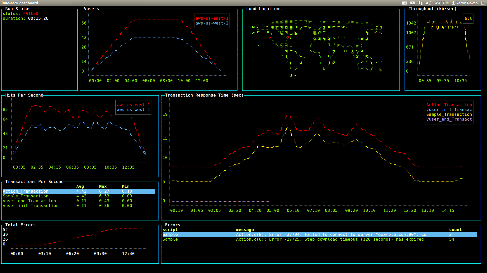

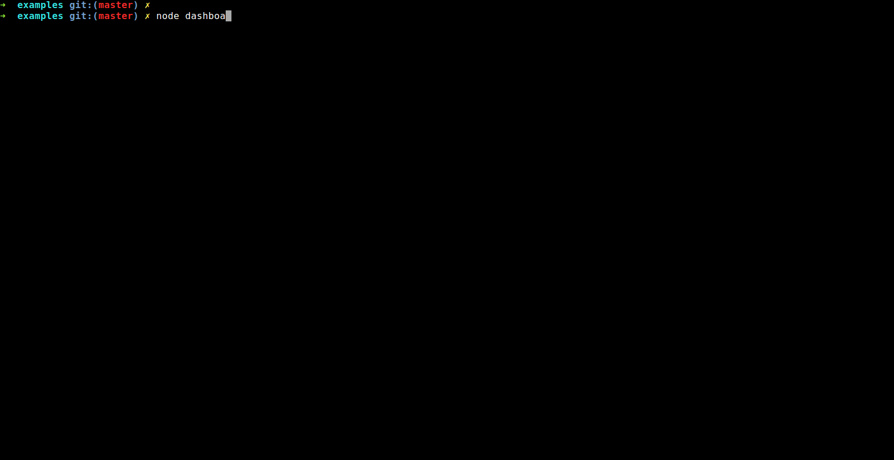

([source code](./examples/dashboard.js))

**Running the demo**

    git clone https://github.com/yaronn/blessed-contrib.git
    cd blessed-contrib
    npm install
    node ./examples/dashboard.js

Works on Linux, OS X and Windows. For Windows follow the [pre requisites](http://webservices20.blogspot.co.il/2015/04/running-terminal-dashboards-on-windows.html).

## Installation (to build custom projects)

    npm install blessed blessed-contrib

## Usage

You can use any of the default widgets of [blessed](https://github.com/chjj/blessed) (texts, lists and etc) or the widgets added in blessed-contrib (described below). A [layout](#layouts) is optional but usefull for dashboards. The widgets in blessed-contrib follow the same usage pattern:

`````javascript
   var blessed = require('blessed')
     , contrib = require('blessed-contrib')
     , screen = blessed.screen()
     , line = contrib.line(
         { style:
           { line: "yellow"
           , text: "green"
           , baseline: "black"}
         , xLabelPadding: 3
         , xPadding: 5
         , label: 'Title'})
     , data = {
         x: ['t1', 't2', 't3', 't4'],
         y: [5, 1, 7, 5]
      }
   screen.append(line) //must append before setting data
   line.setData([data])

   screen.key(['escape', 'q', 'C-c'], function(ch, key) {
     return process.exit(0);
   });

   screen.render()
`````

See below for a complete list of widgets.


## Widgets

[Line Chart](#line-chart)

[Bar Chart](#bar-chart)

[Stacked Bar Chart](#stacked-bar-chart)

[Map](#map)

[Gauge](#gauge)

[Stacked Gauge](#stacked-gauge)

[Donut](#donut)

[LCD Display](#lcd-display)

[Rolling Log](#rolling-log)

[Picture](#picture)

[Sparkline](#sparkline)

[Table](#table)

[Tree](#tree)

[Markdown](#markdown)

### Line Chart

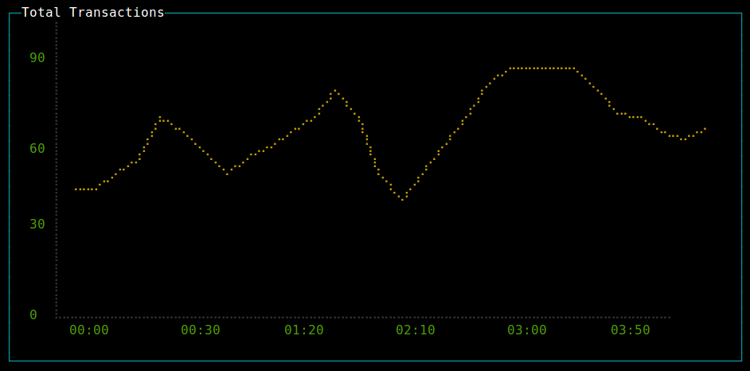

`````javascript
   var line = contrib.line(
         { style:
           { line: "yellow"
           , text: "green"
           , baseline: "black"}
         , xLabelPadding: 3
         , xPadding: 5
         , showLegend: true
         , wholeNumbersOnly: false //true=do not show fraction in y axis
         , label: 'Title'})
   var series1 = {
         title: 'apples',
         x: ['t1', 't2', 't3', 't4'],
         y: [5, 1, 7, 5]
      }
   var series2 = {
         title: 'oranges',
         x: ['t1', 't2', 't3', 't4'],
         y: [2, 1, 4, 8]
      }
   screen.append(line) //must append before setting data
   line.setData([series1, series2])
`````
**Examples:** [simple line chart](./examples/line-fraction.js), [multiple lines](./examples/multi-line-chart.js), [256 colors](./examples/line-random-colors.js)

### Bar Chart

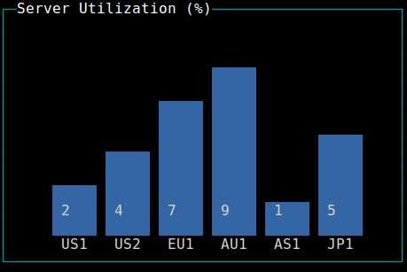

`````javascript
    var bar = contrib.bar(
       { label: 'Server Utilization (%)'
       , barWidth: 4
       , barSpacing: 6
       , xOffset: 0
       , maxHeight: 9})
    screen.append(bar) //must append before setting data
    bar.setData(
       { titles: ['bar1', 'bar2']
       , data: [5, 10]})
`````

### Stacked Bar Chart

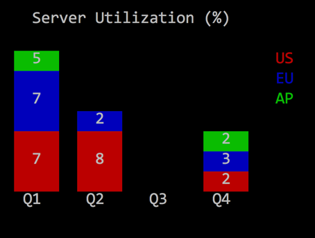

`````javascript
    bar = contrib.stackedBar(
       { label: 'Server Utilization (%)'
       , barWidth: 4
       , barSpacing: 6
       , xOffset: 0
       //, maxValue: 15
       , height: "40%"
       , width: "50%"
       , barBgColor: [ 'red', 'blue', 'green' ]})
    screen.append(bar)
    bar.setData(
       { barCategory: ['Q1', 'Q2', 'Q3', 'Q4']
       , stackedCategory: ['US', 'EU', 'AP']
       , data:
          [ [ 7, 7, 5]
          , [8, 2, 0]
          , [0, 0, 0]
          , [2, 3, 2] ]
       })
`````

### Map

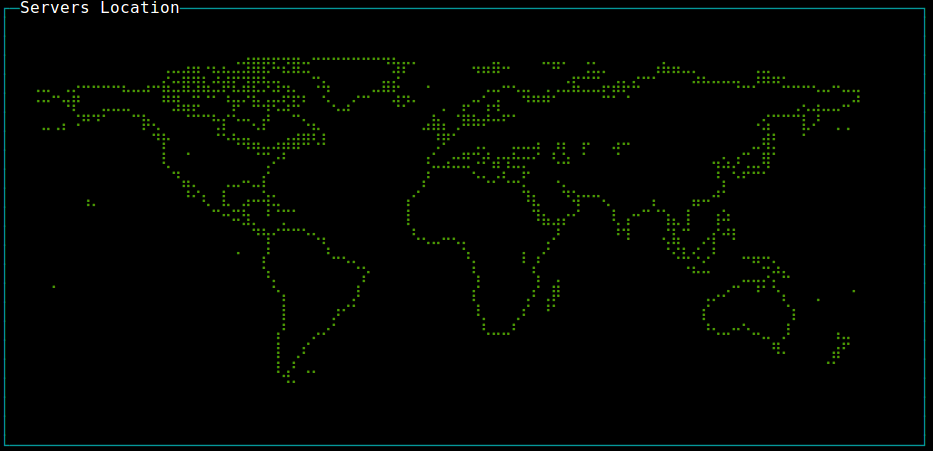

`````javascript
   var map = contrib.map({label: 'World Map'})
   map.addMarker({"lon" : "-79.0000", "lat" : "37.5000", color: "red", char: "X" })
`````


### Gauge

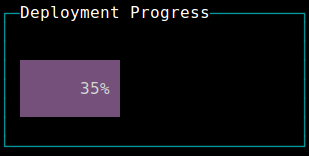

`````javascript
   var gauge = contrib.gauge({label: 'Progress', stroke: 'green', fill: 'white'})
   gauge.setPercent(25)
`````

### Stacked Gauge

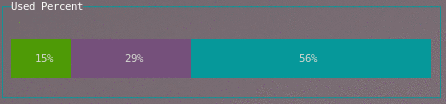

Either specify each stacked portion with a `percent` and `stroke`...

`````javascript
   var gauge = contrib.gauge({label: 'Stacked '})
   gauge.setStack([{percent: 30, stroke: 'green'}, {percent: 30, stroke: 'magenta'}, {percent: 40, stroke: 'cyan'}])
`````

Or, you can just supply an array of numbers and random colors will be chosen.

`````javascript
   var gauge = contrib.gauge({label: 'Stacked Progress'})
   gauge.setStack([30,30,40])
`````

### Donut

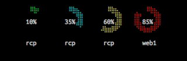


`````javascript
   var donut = contrib.donut({
	label: 'Test',
	radius: 8,
	arcWidth: 3,
	remainColor: 'black',
	yPadding: 2,
	data: [
	  {percent: 80, label: 'web1', color: 'green'}
	]
  });
`````

Data passed in uses `percent` and `label` to draw the donut graph. Color is optional and defaults to green.

`````javascript
   donut.setData([
   	{percent: 87, label: 'rcp','color': 'green'},
	{percent: 43, label: 'rcp','color': 'cyan'},
   ]);
`````

Updating the donut is as easy as passing in an array to `setData` using the same array format as in the constructor. Pass in as many objects to the array of data as you want, they will automatically resize and try to fit. However, please note that you will still be restricted to actual screen space.


### LCD Display

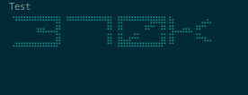

`````javascript
   var lcd = contrib.lcd(
     { segmentWidth: 0.06 // how wide are the segments in % so 50% = 0.5
     , segmentInterval: 0.11 // spacing between the segments in % so 50% = 0.550% = 0.5
     , strokeWidth: 0.11 // spacing between the segments in % so 50% = 0.5
     , elements: 4 // how many elements in the display. or how many characters can be displayed.
     , display: 321 // what should be displayed before first call to setDisplay
     , elementSpacing: 4 // spacing between each element
     , elementPadding: 2 // how far away from the edges to put the elements
     , color: 'white' // color for the segments
     , label: 'Storage Remaining'})
`````

`````javascript

	lcd.setDisplay(23 + 'G'); // will display "23G"
	lcd.setOptions({}) // adjust options at runtime

`````

Please see the **examples/lcd.js** for an example. The example provides keybindings to adjust the `segmentWidth` and `segmentInterval` and `strokeWidth` in real-time so that you can see how they manipulate the look and feel.


### Rolling Log

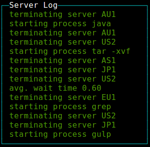

`````javascript
   var log = contrib.log(
      { fg: "green"
      , selectedFg: "green"
      , label: 'Server Log'})
   log.log("new log line")
`````


### Picture

(Also check the new blessed [image implementation](https://github.com/chjj/blessed#image-from-box) which has several benefits over this one.)


`````javascript
    var pic = contrib.picture(
       { file: './flower.png'
       , cols: 25
       , onReady: ready})
    function ready() {screen.render()}
`````

note: only png images are supported


### Sparkline

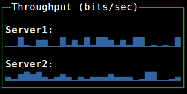

`````javascript
   var spark = contrib.sparkline(
     { label: 'Throughput (bits/sec)'
     , tags: true
     , style: { fg: 'blue' }})

   sparkline.setData(
   [ 'Sparkline1', 'Sparkline2'],
   [ [10, 20, 30, 20]
   , [40, 10, 40, 50]])
`````

### Table

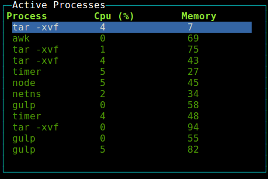

`````javascript
   var table = contrib.table(
     { keys: true
     , fg: 'white'
     , selectedFg: 'white'
     , selectedBg: 'blue'
     , interactive: true
     , label: 'Active Processes'
     , width: '30%'
     , height: '30%'
     , border: {type: "line", fg: "cyan"}
     , columnSpacing: 10 //in chars
     , columnWidth: [16, 12, 12] /*in chars*/ })

   //allow control the table with the keyboard
   table.focus()

   table.setData(
   { headers: ['col1', 'col2', 'col3']
   , data:
      [ [1, 2, 3]
      , [4, 5, 6] ]})
`````

### Tree

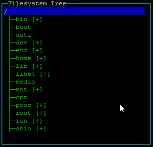

`````javascript
   var tree = contrib.tree({fg: 'green'})

   //allow control the table with the keyboard
   tree.focus()

   tree.on('select',function(node){
     if (node.myCustomProperty){
       console.log(node.myCustomProperty);
     }
     console.log(node.name);
   }

   // you can specify a name property at root level to display root
   tree.setData(
   { extended: true
   , children:
     {
       'Fruit':
       { children:
         { 'Banana': {}
         , 'Apple': {}
         , 'Cherry': {}
         , 'Exotics': {
             children:
             { 'Mango': {}
             , 'Papaya': {}
             , 'Kiwi': { name: 'Kiwi (not the bird!)', myCustomProperty: "hairy fruit" }
             }}
         , 'Pear': {}}}
     , 'Vegetables':
       { children:
         { 'Peas': {}
         , 'Lettuce': {}
         , 'Pepper': {}}}}})
`````

#### Options

 * keys : Key to expand nodes. Default : ['enter','default']
 * extended : Should nodes be extended/generated by default? Be careful with this setting when using a callback function. Default : false
 * template :
   * extend : Suffix "icon" for closed node. Default : '[+]'
   * retract : Suffix "icon" for opened node. Default : '[-]'
   * lines : Show lines in tree. Default : true

#### Nodes

Every node is a hash and it can have custom properties that can be used in "select" event callback. However, there are several special keys :

 * name
  * *Type* : `string`
  * *Desc* : Node name
  * If the node isn't the root and you don't specify the name, will be set to hash key
  * *Example* : <code>{ name: 'Fruit'}</code>
 * children
  * *Type* : `hash` or `function(node){ return children }`
  * *Desc* : Node children.
  * The function must return a hash that could have been used as children property
  * If you use a function, the result will be stored in `node.childrenContent` and `children`
  * *Example* :
    * Hash : <code>{'Fruit':{ name: 'Fruit', children:{ 'Banana': {}, 'Cherry': {}}}}</code>
    * Function : see `examples/explorer.js`
 *  childrenContent
  * *Type* : `hash`
  * *Desc* : Children content for internal usage *DO NOT MODIFY*
  * If `node.children` is a hash, `node.children===node.childrenContent`
  * If `node.children` is a function, it's used to store the `node.children()` result
  * You can read this property, but you should never write it.
  * Usually this will be used to check `if(node.childrenContent)` in your `node.children` function to generate children only once
 * extended
  * *Type* : `boolean`
  * *Desc* : Determine if this node is extended
  * No effect when the node have no child
  * Default value for each node will be `treeInstance.options.extended` if the node `extended` option is not set
  * *Example* : <code>{'Fruit':{ name: 'Fruit', extended: true, children:{ 'Banana': {}, 'Cherry': {}}}}</code>

### Markdown

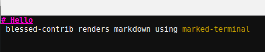

`````javascript
   var markdown = contrib.markdown()
   markdown.setMarkdown('# Hello \n blessed-contrib renders markdown using `marked-terminal`')
`````

### Colors
You can use 256 colors ([source](./examples/line-random-colors.js)):

`````javascript
  function randomColor() {
    return [Math.random() * 255,Math.random()*255, Math.random()*255]
  }

  line = contrib.line(
  {
    ...
    , style: { line: randomColor(), text: randomColor(), baseline: randomColor() }
  })
`````
   
### Layouts

[Grid](#grid)

[Carousel](#carousel)

### Grid

A grid layout can auto position your elements in a grid layout.
When using a grid, you should not create the widgets, rather specify to the grid which widget to create and with which params.
Each widget can span multiple rows and columns.

`````javascript
   var screen = blessed.screen()

   var grid = new contrib.grid({rows: 12, cols: 12, screen: screen})

   //grid.set(row, col, rowSpan, colSpan, obj, opts)
   var map = grid.set(0, 0, 4, 4, contrib.map, {label: 'World Map'})
   var box = grid.set(4, 4, 4, 4, blessed.box, {content: 'My Box'})

   screen.render()
`````

### Carousel
A carousel layout switches between different views based on time or keyboard activity.
One use case is an office dashboard with rotating views:

`````javascript
    var blessed = require('blessed')
      , contrib = require('./')
      , screen = blessed.screen()

    function page1(screen) {
       var map = contrib.map()
       screen.append(map)
    }

    function page2(screen) {
      var line = contrib.line(
       { width: 80
       , height: 30
       , left: 15
       , top: 12
       , xPadding: 5
       , label: 'Title'
       })

      var data = [ { title: 'us-east',
                 x: ['t1', 't2', 't3', 't4'],
                 y: [0, 0.0695652173913043, 0.11304347826087, 2],
                 style: {
                  line: 'red'
                 }
               }
            ]

      screen.append(line)
      line.setData(data)
    }

    screen.key(['escape', 'q', 'C-c'], function(ch, key) {
      return process.exit(0);
    });

    var carousel = new contrib.carousel( [page1, page2]
                                       , { screen: screen
                                         , interval: 3000 //how often to switch views (set 0 to never swicth automatically)
                                         , controlKeys: true  //should right and left keyboard arrows control view rotation
                                         })
    carousel.start()

`````

## Samples


### Terminal Dashboard


**Running the sample**

    git clone https://github.com/yaronn/blessed-contrib.git
    cd blessed-contrib
    npm install
    node ./examples/dashboard.js

**Installation (for a custom dashboard)**

    npm install blessed
    npm install blessed-contrib


**A simple dashboard**

`````javascript
   var blessed = require('blessed')
     , contrib = require('blessed-contrib')
     , screen = blessed.screen()
     , grid = new contrib.grid({rows: 1, cols: 2, screen: screen})

   var line = grid.set(0, 0, 1, 1, contrib.line,
     { style:
       { line: "yellow"
       , text: "green"
       , baseline: "black"}
     , xLabelPadding: 3
     , xPadding: 5
     , label: 'Stocks'})

   var map = grid.set(0, 1, 1, 1, contrib.map, {label: 'Servers Location'})

   var lineData = {
      x: ['t1', 't2', 't3', 't4'],
      y: [5, 1, 7, 5]
   }

   line.setData([lineData])

   screen.key(['escape', 'q', 'C-c'], function(ch, key) {
     return process.exit(0);
   });

   screen.render()
`````

**Rich dashboard**

See [source code](./examples/dashboard.js)

## Troubleshooting
If you see questions marks or some (or all) missign characters try running with these env vars to fix encoding / terminal: 
`````
    $> LANG=en_US.utf8 TERM=xterm-256color node your-code.js 
`````

## License
This library is under the [MIT License](http://opensource.org/licenses/MIT)

## More Information
Created by Yaron Naveh ([twitter](http://twitter.com/YaronNaveh), [blog](http://webservices20.blogspot.com/))
